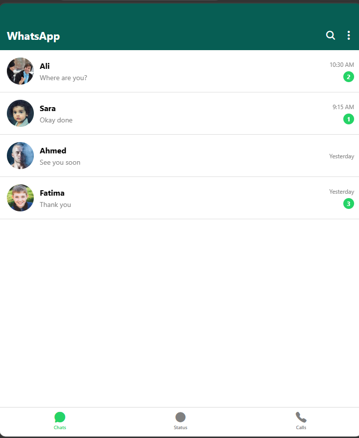
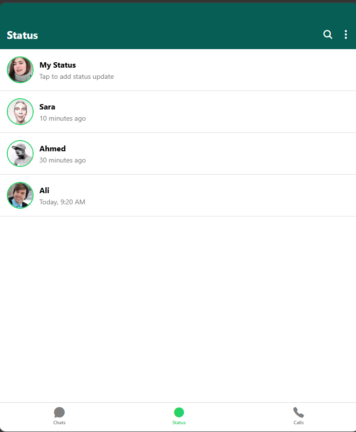
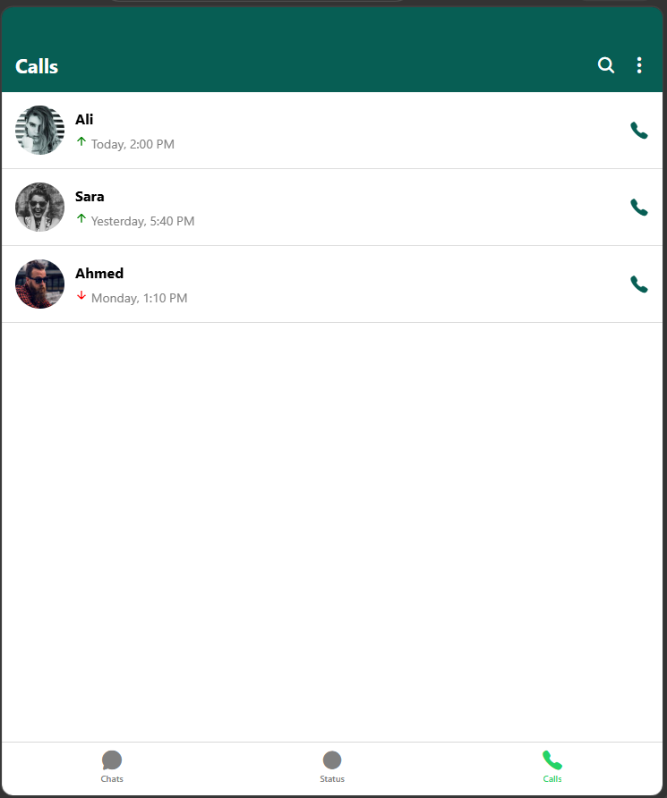

# WhatsApp Clone (React Native + Expo)

##  Project Description
This is a WhatsApp UI Clone built using React Native and Expo.  
It recreates three main screens of WhatsApp using modern UI design and React Navigation (Bottom Tabs).

---

## Features
- Bottom Tab Navigation (Chats, Status, Calls)
- WhatsApp-like UI design
- Chats screen with message list
- Status screen with status updates
- Calls screen with call history
- Reusable components (Header, list items)
- Dummy data (no backend required)
- Clean and responsive mobile UI

---

## Technologies Used
- React Native
- Expo
- React Navigation
- React Native Vector Icons

---

## Screens Included
1. Chats Screen  
2. Status Screen  
3. Calls Screen  

---

## App Preview

### Chats Screen

### Status Screen

### Calls Screen

